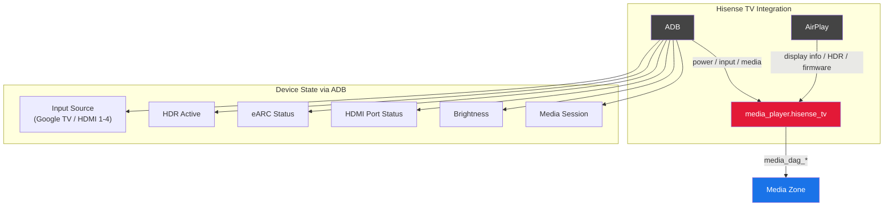

# Hisense TV

[![hacs][hacs-badge]][hacs-url] 

Control Hisense Google TV devices (TVs and laser projectors) via ADB and AirPlay in Home Assistant.

> **Tested on:** Hisense L9Q Laser TV. Should work on any Hisense Google TV device (L5G, PX1, PX2, PX3, U8N, etc.) since the ADB commands are common across the Hisense Google TV platform. If you test on another model, please [open an issue](https://github.com/ltomes/ha-hisense-tv/issues) to confirm compatibility.

## Features

- **ADB Control** -- Power, input switching, volume, media playback via ADB key events
- **Input Source Detection** -- Active input (Google TV, HDMI 1-4) via Hisense `current_source` setting
- **AirPlay Device Info** -- Display resolution, HDR modes, Dolby Vision codecs, firmware version
- **HDR / eARC / HDMI Status** -- Live reporting of HDR activity, eARC connection, and per-port HDMI status
- **Media Session Tracking** -- Now-playing from any app using Android MediaSession API
- **Device Modes** -- Display-only, source via eARC, or both
- **HDMI Input Mapping** -- Map HDMI inputs to source device entities
- **Controlled ADB Pairing** -- Dedicated pairing step in config flow + re-pair button entity
- **Media DAG Attributes** -- Full signal chain data for [Media Zone](https://github.com/ltomes/ha-media-zone) orchestration

## Installation

### HACS (recommended)

1. Open HACS > Integrations > three-dot menu > Custom repositories
2. Add `https://github.com/ltomes/ha-hisense-tv` as an Integration
3. Search for "Hisense TV" and install
4. Restart Home Assistant

### Manual

Copy `custom_components/hisense_tv` to your HA `config/custom_components/` directory and restart.

## Configuration

1. Settings > Devices & Services > Add Integration > "Hisense TV"
2. Enter the device IP address
3. Approve the ADB pairing prompt on the TV when asked
4. Optionally configure device mode, Jellyfin, receiver, power switch

### ADB Pairing

ADB is paired during setup via a dedicated config flow step. If you need to re-pair later, use the **"Pair ADB"** button on the device page in HA.

Requirements: Settings > System > Developer options > ADB debugging enabled on the TV.

### Options

- **Device Mode** -- Display only, source via eARC, or both
- **HDMI Input Mappings** -- Map each HDMI input to a source device entity
- **Jellyfin** -- For rich playback metadata when using built-in apps
- **Receiver + Input** -- For eARC audio routing coordination
- **Power Switch** -- Smart plug for reliable power state

## Entities

| Entity | Type | Description |
|--------|------|-------------|
| Media Player | `media_player` | Main entity with power, input, volume, playback controls |
| Now Playing | `sensor` | Formatted now-playing string from Jellyfin |
| Display Info | `sensor` | Static display capabilities from AirPlay |
| Pair ADB | `button` | Initiate or re-pair ADB connection |

## Development

Shared ADB helpers live in [ha-adb-common](https://github.com/ltomes/ha-adb-common) and are also used by [ha-nvidia-shield](https://github.com/ltomes/ha-nvidia-shield). For HACS installs, a copy is **vendored** at `custom_components/hisense_tv/ha_adb_common/` so end users need nothing extra. We plan to publish `ha-adb-common` to PyPI so it can be declared as a normal `manifest.json` requirement; until then, the vendored copy is the source consumed at runtime.

To hack on the shared code locally, clone [ha-adb-common](https://github.com/ltomes/ha-adb-common) as a sibling directory and run `uv sync --extra dev` — the `[tool.uv.sources]` section in `pyproject.toml` wires it up editable.

## Part of the Media Zone Ecosystem

This integration works standalone, but pairs with [ha-media-zone](https://github.com/ltomes/ha-media-zone) to create a unified zone controller:

- [ha-media-zone](https://github.com/ltomes/ha-media-zone) -- Orchestrates receiver + display + sources into one entity
- [ha-emotiva-mc1](https://github.com/ltomes/ha-emotiva-mc1) -- RS232 control for Emotiva MC1 receiver
- [ha-nvidia-shield](https://github.com/ltomes/ha-nvidia-shield) -- Enhanced NVIDIA Shield TV with ADB media session tracking

[hacs-badge]: https://img.shields.io/badge/HACS-Custom-41BDF5.svg
[hacs-url]: https://github.com/hacs/integration

## License

MIT
